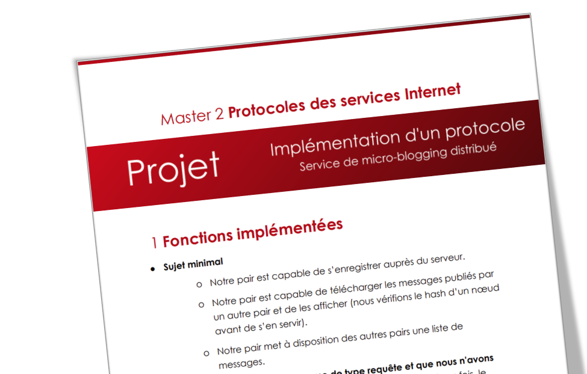

### Implémentation d’un protocole : Service de micro-blogging distribué

> :school: **Lieu de formation :** Université Paris Cité, Campus Grands Moulins (ex-Paris Diderot)
> 
> :books: **UE :** Protocoles des Services Internet
> 
> :pushpin: **Année scolaire :** M2
> 
> :calendar: **Dates :** Décembre 2022 - Janvier 2023
> 
> :chart_with_upwards_trend: **Note :** 14/20

#### Description
Le but de ce projet est d’implémenter un service de micro-blogging (comme par exemple Twitter) mais implémenté de manière hybride : un serveur (HTTPS et UDP) sert à la localisation des pairs et à la distribution des clés cryptographiques; Le transfert de messages est effectué directement entre les pairs (le cahier des charges du projet est disponible [ici](https://www.irif.fr/~jch/enseignement/2022/internet/projet.pdf)). 

#### Principales fonctionnalités
- **Fonctionnalités de base :**
  - Notre pair est capable de s’enregistrer auprès du serveur.
  - Notre pair est capable de télécharger les messages publiés par un autre pair et de les afficher (nous vérifions le hash d’un nœud avant de s’en servir).
  - Notre pair met à disposition des autres pairs une liste de messages.
 
- **Si nous envoyons un datagramme de type requête et que nous n’avons pas reçu de réponse,** nous renvoyons le datagramme plusieurs fois, le timeout entre chaque renvoi augmentant de façon exponentielle.

- **Interface utilisateur via la ligne de commande :** l’utilisateur peut décider avec quel pair il veut communiquer et quelle action il veut effectuer avec ce pair. En même temps, à travers un fil d’exécution (_thread_) séparé, nous attendons l’arrivée de nouveaux messages. Tout ce qui se passe s’affiche clairement à l’écran.

- **Nous sauvegardons en mémoire les sessions que nous avons ouvertes avec d’autres pairs :** cela permet d’éviter de refaire des handshake (_Hello, HelloReply_) à chaque fois qu’on contacte un pair.

- **Nous sauvegardons en mémoire les sessions que d’autres pairs ont ouvertes avec nous.** Si un pair nous demande des informations avant l’échange _Hello, HelloReply_ avec nous, ou si la durée de la session est dépassée, il recevra un datagramme _Error_ (type 254) avec un message d’erreur clair.

- **Nous sauvegardons en mémoire les arbres de Merkle que nous avons obtenus à partir d’autres pairs, avec une mise à jour incrémentale** (déterminer rapidement ce qui a changé et ne télécharger que les parties de l’arbre qui ont changé).
  
- **Nous implémentons l’authentification entre le client et le serveur ainsi qu’entre les pairs.** Nous partageons une clé publique et nous stockons une clé privée. Nous vérifions l’identité du pair ou du serveur à travers les signatures. De même les pairs et le serveur peuvent vérifier notre identité car nous signons nos messages en début de session.

#### Ressources supplémentaires
- [Rapport]()
- [Un exemple de session]()
